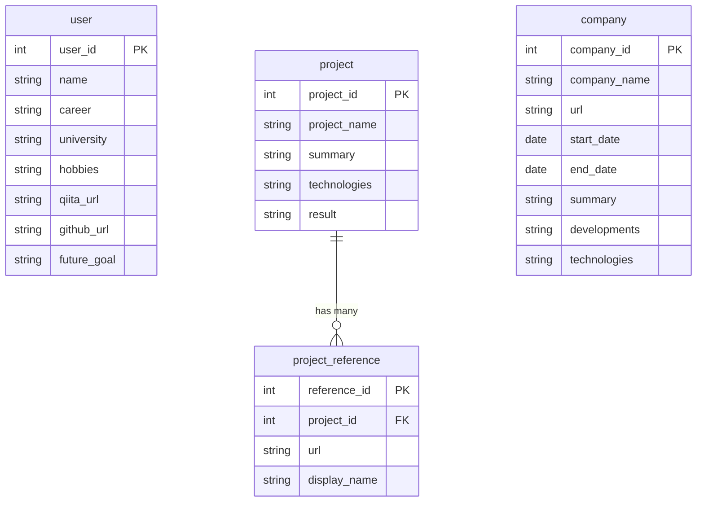

```mermaid
erDiagram
    user {
        int user_id PK
        string name
        string career
        string university
        string hobbies
        string qiita_url
        string github_url
        string future_goal
    }

    project {
        int project_id PK
        string project_name
        string summary
        string technologies
        string result
    }

    project_reference {
        int reference_id PK
        int project_id FK
        string url
        string display_name
    }

    company {
        int company_id PK
        string company_name
        string url
        date start_date
        date end_date
        string summary
        string developments
        string technologies
    }

    project ||--o{ project_reference : "has many"
```
